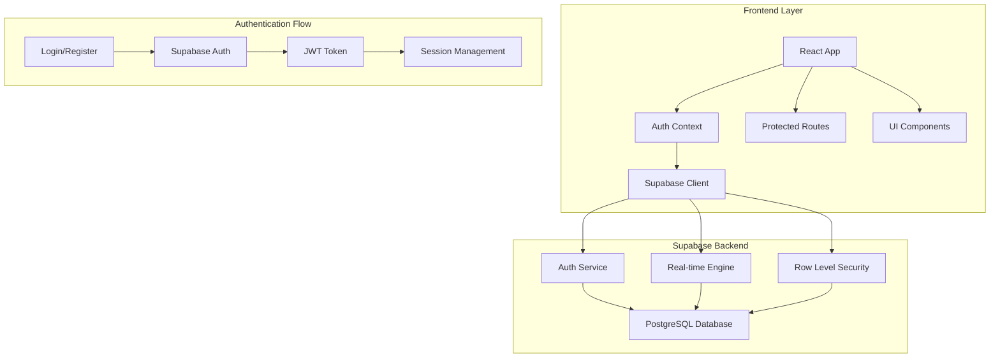
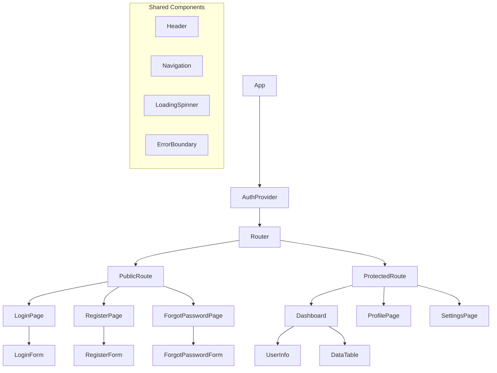
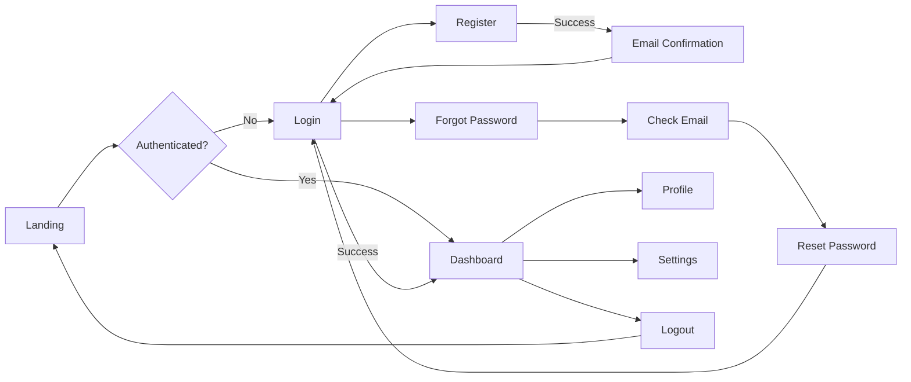

# Web Application with Supabase Integration

## Overview

A modern web application built to interact with Supabase backend-as-a-service platform, featuring comprehensive user authentication and data management capabilities. The application provides a clean, responsive interface for user registration, login, and secure data operations.

### Key Features
- User Authentication (Sign up, Sign in, Sign out)
- Password Reset functionality
- Protected routes and role-based access
- Real-time data synchronization
- Responsive design for all devices

### Technology Stack
- **Frontend Framework**: React 18+ with TypeScript
- **Styling**: Tailwind CSS for responsive design
- **Authentication**: Supabase Auth
- **Database**: Supabase PostgreSQL
- **State Management**: React Context API + useReducer
- **Routing**: React Router v6
- **HTTP Client**: Supabase JavaScript Client
- **Build Tool**: Vite
- **Package Manager**: npm

## Architecture



## Component Architecture

### Component Hierarchy



### Core Components

#### AuthProvider Component
```typescript
interface AuthContextType {
  user: User | null;
  loading: boolean;
  signIn: (email: string, password: string) => Promise<void>;
  signUp: (email: string, password: string) => Promise<void>;
  signOut: () => Promise<void>;
  resetPassword: (email: string) => Promise<void>;
}
```

#### ProtectedRoute Component
- Checks authentication status
- Redirects to login if not authenticated
- Shows loading state during auth check

#### Authentication Forms
- **LoginForm**: Email/password login with validation
- **RegisterForm**: User registration with email confirmation
- **ForgotPasswordForm**: Password reset functionality

## Routing & Navigation

### Route Structure

| Route | Component | Access | Description |
|-------|-----------|--------|-------------|
| `/` | HomePage | Public | Landing page with app overview |
| `/login` | LoginPage | Public | User authentication |
| `/register` | RegisterPage | Public | User registration |
| `/forgot-password` | ForgotPasswordPage | Public | Password reset |
| `/dashboard` | Dashboard | Protected | Main user interface |
| `/profile` | ProfilePage | Protected | User profile management |
| `/settings` | SettingsPage | Protected | Application settings |

### Navigation Flow



## Styling Strategy

### Tailwind CSS Configuration
- Custom color palette matching brand identity
- Responsive breakpoints for mobile-first design
- Dark mode support with CSS variables
- Component-based utility classes

### Design System
- **Colors**: Primary, secondary, accent, neutral tones
- **Typography**: Inter font family with defined scales
- **Spacing**: 8px base grid system
- **Components**: Reusable button, input, card components

## State Management

### Authentication State
```typescript
interface AuthState {
  user: User | null;
  session: Session | null;
  loading: boolean;
  error: string | null;
}

type AuthAction = 
  | { type: 'SET_USER'; payload: User | null }
  | { type: 'SET_SESSION'; payload: Session | null }
  | { type: 'SET_LOADING'; payload: boolean }
  | { type: 'SET_ERROR'; payload: string | null };
```

### Global State Pattern
- React Context for authentication state
- useReducer for complex state logic
- Local state for component-specific data
- Custom hooks for state abstraction

## API Integration Layer

### Supabase Client Configuration
```typescript
interface SupabaseConfig {
  url: string;
  anonKey: string;
  options: {
    auth: {
      autoRefreshToken: boolean;
      persistSession: boolean;
      detectSessionInUrl: boolean;
    }
  }
}
```

### Authentication Methods

#### Sign Up Flow
1. User submits registration form
2. Supabase creates user account
3. Email confirmation sent
4. User confirms email
5. Account activated

#### Sign In Flow
1. User submits credentials
2. Supabase validates credentials
3. JWT token generated
4. Session established
5. User redirected to dashboard

#### Password Reset Flow
1. User requests password reset
2. Supabase sends reset email
3. User clicks reset link
4. New password form displayed
5. Password updated in database

### Data Operations
- **Create**: Insert new records with user context
- **Read**: Fetch data with RLS policies
- **Update**: Modify existing records
- **Delete**: Soft delete with audit trail

## Testing Strategy

### Unit Testing
- **Framework**: Jest + React Testing Library
- **Coverage**: Components, hooks, utilities
- **Mocking**: Supabase client methods

### Integration Testing
- Authentication flows
- API endpoint interactions
- Route protection mechanisms

### Test Structure
```
src/
├── __tests__/
│   ├── components/
│   ├── hooks/
│   ├── utils/
│   └── integration/
```

### Key Test Cases
- User authentication scenarios
- Protected route access
- Form validation logic
- Error handling mechanisms
- Session management

## Security Considerations

### Row Level Security (RLS)
- Database-level access control
- User-specific data isolation
- Policy-based permissions

### Authentication Security
- JWT token validation
- Session timeout handling
- Secure password requirements
- Email verification mandatory

### Data Protection
- Input sanitization
- SQL injection prevention
- XSS protection measures
- HTTPS enforcement

## Environment Configuration

### Development Environment
```env
VITE_SUPABASE_URL=your-supabase-url
VITE_SUPABASE_ANON_KEY=your-anon-key
VITE_APP_TITLE=Your App Name
```

### Production Considerations
- Environment variable management
- SSL certificate configuration
- CDN setup for static assets
- Performance monitoring